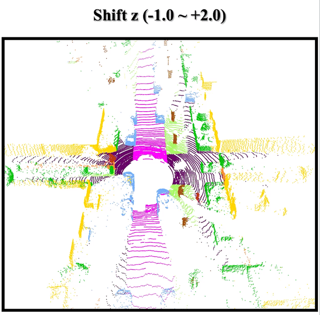

<div align="center">

<h1>SN-LiDAR: Semantic Neural Fields for Novel Space-time View LiDAR Synthesis</h1>  

Yi Chen*, Tianchen Deng*, Wentao Zhao, Xiaoning Wang, Wenqian Xi, Weidong Chen, Jingchuan Wang† 

(* Equal contribution,† Corresponding author)  


**[Paper]() | [Project Page]() | [Video]() | [Poster]()**

This repository is the official PyTorch implementation for SN-LiDAR.


</div>

<!-- TABLE OF CONTENTS -->
<details open="open" style='padding: 10px; border-radius:5px 30px 30px 5px; border-style: solid; border-width: 1px;'>
  <summary>Table of Contents</summary>
  <ol>
    <li>
      <a href="#demo">Demo</a>
    </li>
    <li>
      <a href="#overview">Overview</a>
    </li>
    <li>
      <a href="#getting-started">Getting started</a>
    </li>
    <li>
      <a href="#simulation">Simulation</a>
    </li>
    <li>
      <a href="#acknowledgement">Acknowledgement</a>
    </li>
    <li>
      <a href="#citation">Citation</a>
    </li>
  </ol>
</details>


## Demo

- Novel Space-time Synthesis on SemanticKITTI

</img>

- Novel LiDAR Poses (X, Y, Z Shift)
<div>
  
  
  
</div>

- Novel LiDAR Configuration (Beam change, Fov change)
<div>
  
  
</div>

- Reconstruction of Dynamic Objects

</img>


## Overview
  

We propose SN-LiDAR, the first differential LiDAR-only framework for novel space-time LiDAR view synthesis with semantic labels, which achieves accurate semantic segmentation, high-quality geometric reconstruction, and realistic LiDAR synthesis. We integrate global geometric features from multi-resolution planar-grid representation with local semantic features from CNN-based semantic encoder. This fusion method not only strengthens the mutual enhancement between geometry and semantics but also enables processing large-scale scenes from coarse to fine.

<a id="getting-started"></a>

## Getting started


### 🛠️ Installation

```bash
git clone https://github.com/dtc111111/SN-Lidar.git
cd SN-Lidar

# TODO
```


### 📁 Dataset

#### SemanticKITTI dataset ([Download](https://www.semantic-kitti.org/))
We use sequence 00-10 for experiments in our paper.   

Download SemanticKITTI dataset and put them into `data/semantickitti`.  
(or use symlinks: `ln -s DATA_ROOT/dataset ./data/semantickitti/`).  
The folder tree is as follows:  

```bash
data
└── semantickitti
    └── dataset
        └── sequences
            ├── 00
            │   ├── labels
            │   ├── velodyne
            │   ├── calib.txt
            │   ├── poses.txt
            │   └── times.txt
            └── 01
```

Next, run SemanticKITTI dataset preprocessing: 

```bash
# set $DATASET, $LIDAR_TYPE, $SEQ_NAME and $SEQ_ID
bash preprocess_data_semkitti.sh
```

After preprocessing, your folder structure should look like this:  

```bash
configs
├── semantickitti_{sequence_name}_{lidar_type}_{sequence_id}.txt
data
└── semantickitti
    ├── dataset
    ├── train
    ├── transforms_{sequence_name}_{lidar_type}_{sequence_id}_test.json
    ├── transforms_{sequence_name}_{lidar_type}_{sequence_id}_train.json
    └── transforms_{sequence_name}_{lidar_type}_{sequence_id}_val.json
```

### 🚀 Run SN-LiDAR

<a id="simulation"></a>

## 🕹️ Simulation


## Acknowledgement
We would like to thank all the pioneers [LiDAR-NeRF](https://github.com/tangtaogo/lidar-nerf), [LiDAR4D](https://github.com/ispc-lab/LiDAR4D), [CENet](https://github.com/huixiancheng/CENet).


## Citation
If your like our projects, please cite us and support us with a star 🌟.
<!-- ```bibtex

``` -->
